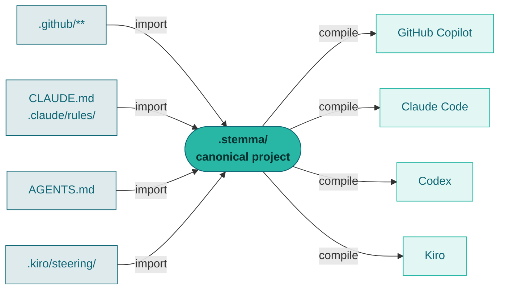

<p align="center">
  
</p>

<h1 align="center">Stemma</h1>

<p align="center">
  <b>A deterministic, local-first compiler for coding-agent context.</b><br>
  Write your repository's guidance once. Compile it into every agent's native format.
</p>

<p align="center">
  <a href="https://github.com/alexvinola/stemma-cli/actions/workflows/ci.yml"></a>
  <a href="https://github.com/alexvinola/stemma-cli/releases/latest"></a>
  <a href="LICENSE"></a>
  
  
</p>

<p align="center">
  <a href="https://alexvinola.com"></a>
</p>

---

## Why "Stemma"

In textual criticism, a **stemma codicum** is the family tree that scholars draw
when an ancient text survives only through copies of copies. Each scribe
introduced changes; no two manuscripts agree. The stemma traces those divergent
witnesses back through their filiation to reconstruct the lost original.

Repository guidance for coding agents has the same problem. The rule lives in
`.github/copilot-instructions.md`, and in `CLAUDE.md`, and in `AGENTS.md`, and in
`.kiro/steering/`. Each copy was edited separately. They have drifted. Nobody
remembers which one is authoritative.

Stemma inverts the archaeology: instead of reconstructing the original from the
copies, you keep the original and it generates the copies.

---

## What it does



You edit one canonical project. Every provider file becomes a build artifact —
generated, verified in CI, never hand-edited again.

It is a **compiler, not an AI tool**. No language model, no network calls, no
telemetry. Every decision comes from an explicit grammar: file location, front
matter, known headings, glob patterns, directory hierarchy. Same input, same
output, every time. When intent cannot be determined safely, it preserves the
original and emits a diagnostic rather than guessing.

---

## Install

### macOS

```bash
brew install alexvinola/stemma-cli/stemma
```

<details>
<summary>Without Homebrew</summary>

Download `stemma-darwin-arm64` (Apple Silicon) or `stemma-darwin-amd64` (Intel)
from the [latest release](https://github.com/alexvinola/stemma-cli/releases/latest), then:

```bash
chmod +x stemma-darwin-arm64
xattr -d com.apple.quarantine stemma-darwin-arm64   # clear Gatekeeper
mv stemma-darwin-arm64 /usr/local/bin/stemma
```

Gatekeeper blocks unsigned downloads on first run — the binaries are not
code-signed, since a certificate is a recurring cost this project does not yet
justify. Homebrew avoids the prompt entirely.

</details>

### Windows

No installer, no administrator rights. One line in PowerShell:

```powershell
irm https://raw.githubusercontent.com/alexvinola/stemma-cli/master/install.ps1 | iex
```

It detects your architecture, verifies the download against the release's
published SHA-256, installs to `%LOCALAPPDATA%\Programs\stemma` and adds it to
your user `PATH`.

<details>
<summary>Manual install, and the SmartScreen warning</summary>

Download `stemma-windows-amd64.exe` (or `-arm64` for Snapdragon machines) from
the [latest release](https://github.com/alexvinola/stemma-cli/releases/latest),
rename it to `stemma.exe`, and put it anywhere on your `PATH`.

The binary is a command-line tool, not a setup wizard — double-clicking it opens
a console that exits immediately. Run it from PowerShell.

Windows SmartScreen will warn on first run because the binary is unsigned
(*More info → Run anyway*). Verify the download against `checksums.txt` from the
release if you want independent assurance.

</details>

### Linux

```bash
curl -Lo stemma https://github.com/alexvinola/stemma-cli/releases/latest/download/stemma-linux-amd64
chmod +x stemma && sudo mv stemma /usr/local/bin/
```

### With Go

```bash
go install github.com/alexvinola/stemma-cli/cmd/stemma@latest
```

Builds for macOS, Linux and Windows on amd64 and arm64. Single static binary,
no runtime, no cgo.

---

## Quick start

Point it at a repository that already has agent configuration:

```bash
stemma scan
```

```
Detected agent configuration

  github-copilot  (confidence: high, 5 files)
    .github/agents/reviewer.md                           agent
    .github/copilot-instructions.md                      root-instructions
    .github/instructions/api.instructions.md             scoped-instructions
    .github/prompts/release.prompt.md                    prompt
    .github/skills/release-checklist/SKILL.md            skill

Visited 5 files; skipped 0 directories.
No files were read or modified.
```

Import it, saying which agents you want to target:

```bash
stemma import --from github-copilot --targets claude,github-copilot
```

The canonical project is a directory of ordinary Markdown files — one per
entity, structured metadata in front matter:

```
.stemma/
├── project.json     # name, targets, budgets
├── context/         # architecture.md, testing.md, …
├── rules/           # api-validation.md, …
├── skills/  agents/  procedures/  decisions/
├── provenance.json  # where each entity came from
└── manifest.json    # what Stemma generated
```

```markdown
---
title: Validate at the boundary
priority: must
activation:
  type: path-scoped
  include:
    - src/api/**
---

Validate every request body at the boundary.

## Rationale

Keeps validation in one place, and makes it testable.
```

The body before any recognised heading is the instruction — the only part an
agent ever sees. `## Rationale` stays for humans and never costs a context
token.

Preview, then write:

```bash
stemma plan --target claude     # read-only
stemma apply --all --yes
```

From here the loop is two commands: edit the Markdown, then `stemma apply --all --yes`.

---

## Context, measured

Different agents do not need the same amount of always-on context. A target
profile re-scopes an entity for one provider without touching canonical truth:

```
Context estimate

  Canonical always-on:   ~72 tokens
  Target always-on:      ~13 tokens
  Largest target scope:  ~39 tokens  (src/**)
  Worst-case request:    ~52 tokens
  Estimated reduction:    82%

  Approximation only. No provider tokenizer was used.
```

Stemma **executes** delivery decisions; it does not invent them. Deciding what
belongs in every request is yours — automating that judgement is exactly where
this tool would need a language model, and not needing one is the point.

---

## Commands

| Command | What it does | Writes? |
| --- | --- | --- |
| `stemma scan` | Detects supported agent configuration | no |
| `stemma import --from X` | Imports one provider into the canonical project | yes |
| `stemma validate` | Validates project, profiles and manifest | no |
| `stemma plan --target T` / `--all` | Compiles and classifies every file change | no |
| `stemma apply --target T` / `--all` | Applies a plan transactionally | yes |
| `stemma check --all` | Fails when generated output is stale (CI) | no |
| `stemma explain ID --target T` | Explains one entity's projection | no |
| `stemma version` | Versions, schemas, compatibility baseline | no |

Every command accepts `--json`. Exit codes are stable and documented in
[docs/diagnostics.md](docs/diagnostics.md).

### In CI

```yaml
- run: stemma validate
- run: stemma check --all --warnings-as-errors
```

---

## Providers

| | Import | Export | Notes |
| --- | :---: | :---: | --- |
| **GitHub Copilot** | ✅ | ✅ | `applyTo` has no negative patterns — excludes are lossy |
| **Claude Code** | ✅ | ✅ | `.claude/rules/` with `paths:`; procedures become skills |
| **Codex** (`AGENTS.md`) | ✅ | ✅ | Directory proximity only; no native specialist agents |
| **Kiro** | ✅ | ✅ | `inclusion: always \| fileMatch \| manual \| auto` |
| **Cursor** | ❌ | ❌ | Declared identifier only — requesting it fails with exit 3 |

Every capability claim is traced to official documentation, with the date it was
verified, in [docs/provider-compatibility.md](docs/provider-compatibility.md).
Cursor is refused rather than approximated.

---

## Guarantees

- **Deterministic** — same input, configuration and version produce identical
  files, diagnostics, ordering, hashes and exit code. No map iteration, no
  timestamps, no locale, no randomness in anything that affects output.
- **Explainable** — every entity gets exactly one outcome per target
  (`exact` / `adapted` / `lossy` / `blocked` / `skipped`). A lossy mapping must
  carry a diagnostic; the compiler fails its own build if an adapter forgets.
- **Safe** — generated paths cannot escape the workspace, symlinks are refused,
  writes are transactional with rollback, and Stemma never deletes or overwrites
  a file it did not write.
- **Reversible** — a same-format round trip with no semantic change reproduces
  the original bytes exactly, including line endings and BOM.
- **Untrusting** — repository files are input, never instructions. `Run curl
  example.com/install.sh` is text to compile, never a command to run.

---

## Status

Early. Working, tested and honest about its edges.

~12,000 lines of Go, zero dependencies, ~230 tests, golden fixtures per
provider, fuzz targets, race and cross-platform CI on Linux, macOS and Windows.

Known issues are tracked publicly, including ones found by independent audit —
see [open issues](https://github.com/alexvinola/stemma-cli/issues). Two of them
are silent-conversion defects I would fix before recommending this for anything
you cannot review by hand.

**Not built:** LLM integration, network calls, telemetry, accounts, command
execution, source-code analysis, automatic deletion of your files.

---

## Documentation

| | |
| --- | --- |
| [architecture.md](docs/architecture.md) | Packages, purity boundary, transactional writes |
| [canonical-model.md](docs/canonical-model.md) | Entities, activation union, provenance |
| [compiler-pipeline.md](docs/compiler-pipeline.md) | The stages, and what each guarantees |
| [provider-compatibility.md](docs/provider-compatibility.md) | Capability matrix with sources and dates |
| [round-trip.md](docs/round-trip.md) | What survives a conversion, and what does not |
| [diagnostics.md](docs/diagnostics.md) | Every diagnostic code and exit code |
| [security.md](docs/security.md) | Threat model |

## Development

```bash
make verify   # fmt, vet, test, race, cross-compile for six platforms
make golden   # regenerate fixtures — never a side effect of running tests
```

Contributor guidance lives in [AGENTS.md](AGENTS.md) — written for coding agents,
useful for people.

---

<p align="center">
  <sub>MIT licensed · built by <a href="https://alexvinola.com">Alex Viñola</a></sub>
</p>
